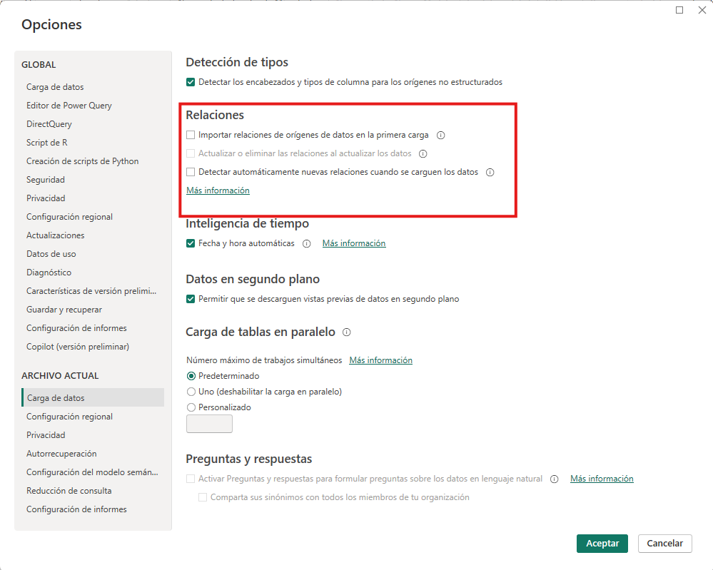
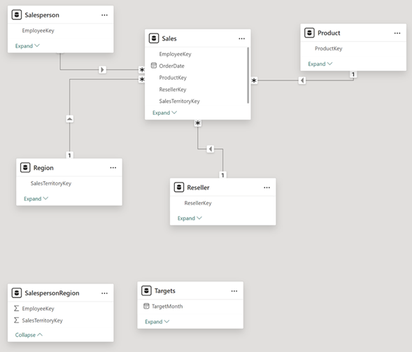

# Ejercicio #1

## Planteamiento del ejercicio.

>Como parte de las actividades de desarrollo de un reporte, le piden descargar y modelar los datos dentro de la aplicación de Power BI Desktop. Entre las tareas que realizara en este laboratorio se encuentran la extracción de los datos, el proceso de limpiar los datos y analizar las relaciones entre las tablas. As+i como decidir si se conservan las tablas o se dejan de lado.

### Objetivo

>El objetivo es poner en práctica lo aprendido en el primer capítulo del curso, aplicándolo en un mini proyecto que aborde de forma consecutiva, las fases del proceso de desarrollo de un informe dentro de Power BI.

### Tiempo estimado

>Dependiendo la experiencia y la familiaridad que se tenga con el uso de Power BI, el ejercicio podrá tomar mas o menos tiempo. Pero se estima que para realizar este ejercicio de forma exitosa involucra alrededor de unos 50 minutos.

### Actividades a realizar.

## Configuración de Power BI.
Comenzaremos configurando la herramienta para que, al momento de seleccionar los orígenes de los datos, no se generen las relaciones de forma automática. Para ello, ingresaremos a Power BI e iremos a la sección de Archivo > Opciones y Configuración > Opciones > Carga de datos. Y desmarcaremos las opciones de relacionadas con las relaciones.

## Acceso a los orígenes de los datos.

Un usuario nos pide obtener información desde la base de datos AdventureWorksDW2020, el usuario nos comenta que no es necesario obtener información en tiempo real y que prefiere evitar saturar con consultas al servidor de la base datos.

Al configurar la conexión al origen de datos para obtener la información de las siguientes tablas:

* DimEmployee
* DimEmployeeSalesTerritory
* DimProduct
* DimReseller
* DimSalesTerritory
* FactResellerSales

Antes de cargar toda la información al modelo semántico de Power BI, debemos realizar un análisis de las columnas y los valores que vamos importar, en ese sentido, explora los valores de las distintas tablas y realiza las operaciones dentro de cada una de ellas:

* DimEmployee (Almacena una fila para cada empleado)  
    * Nos piden realizar la transformación necesaria para renombrar la consulta a Salesperson.
    * En este sentido, ahora la tabla solamente tendrá los registros de vendedores y de ningún otro rol de la empresa, filtre los registros dentro de la tabla para solamente tener vendedores.

        > La tabla tiene la columna SalesPersonFlag que puede ser útil para realizar este filtrado.

    * Nos piden que la tabla quede con solamente las siguientes columnas:
        * EmployeeKey
        * EmployeeNationalIDAlternateKey

            > Sería buena idea cambiar el nombre de esta columna por algo mas amigable para el usuario como renombrarlo a EmployeeID

        * FirstName
        * LastName
        * Title
        * EmailAddress 
        
            > En ciertos contextos, la dirección de correo electrónico, puede ser identificado con las siglas UPN, por lo que para mantener la consistencia, renombremos esta columna a UPN
    * Nos piden combinar las columnas FirstName y LastName. La columna nueva se llamará Salesperson.

* DimEmployeeSalesTerritory (Contiene el territorio que maneja un vendedor)
    * Nos piden renombrar esta consulta a SalespersonRegion.
    * Nos piden que eliminemos las columnas DimEmployee y DimSalesTerritory.

* DimProduct (Contiene una fila por producto vendido por la empresa)
    * Nos piden renombrar la consulta a Product.
    * De la información que vamos a modelar solamente nos interesan aquellos productos que están terminados.

        > Observa la columna FinishedGoodsFlag que puede ser util para realizar este filtrado.

    * Mantendremos las siguientes columnas:
        * ProductKey
        * EnglishProductName que renombraremos como Product
        * StandardCost que renombraremos como Standard Cost
        * Color
        * DimProductSubcategory que renombraremos como Subcategory

    * Vamos a expandir la columna DimProductSubcategory, y dejaremos solamente las columnas:
        * EnglishProductSubcategoryName
        * DimProductCategory
            
            > Las columnas no tendrán ningún prefijo.

    * Nos piden realizar la misma acción para la columna DimProductCategory, para solamente dejar la columna EnglishProductCategoryName que renombraremos como Category

* DimReseller (Contiene una fila por revendedor. Los revendedores venden, distribuyen o agregan valor a los productos)

    * Renombraremos la consulta a Reseller.

    * Dejaremos en la consulta solamente las siguientes columnas:
        
        * ResellerKey
        * BusinessType vamos a renombrarla para incluir un espacio
        * ResellerName vamos a renombrarla como Reseller
        * DimGeography
    
    * De esta ultima columna, nos piden que expandamos la columna para dejar solamente los valores de las siguientes columnas:

        * City
        * StateProvinceName
        * EnglishCountryRegionName la renombraremos como Country-Region

    * Analizando los valores de Business Type, ¿Qué notas de raro? Realiza los cambios necesarios dentro de esta columna para garantizar la integridad de la información de todos los registros.
            
        > Sabemos que los valores son distintos si contienen o no los mismos caracteres, por ejemplo, Warehouse y Ware house no son considerados iguales.

* DimSalesTerritory (contiene una fila por región de ventas. Las regiones se asignan a un país y los países se asignan a grupos)
    
    * Vamos a renombrar la consulta a Region
    
    * En esta consulta, vemos que hay un valor que tiene el valor de cero en la columna SalesTerritoryAlternateKey, vamos a eliminar ese registro en particular.

    * Dejaremos en la consulta solamente las siguientes columnas:
    
        * SalesTerritoryKey

        * SalesTerritoryRegion que renombraremos a Region

        * SalesTerritoryCountry que cambiaremos a Country

        * SalesTerritoryGroup pasará a llamarse Group

* FactResellerSales (Contiene una fila por línea de pedido de ventas: un pedido de ventas contiene uno o más elementos de línea)

    * Renombraremos esta consulta a Sales para identificarla de mejor manera.

    * La información que necesita el equipo esta almacenada en las siguientes columnas:

        * SalesOrderNumber

        * OrderDate

        * ProductKey

        * ResellerKey

        * EmployeeKey

        * SalesTerritoryKey

        * OrderQuantity renombrada a Quantity

        * UnitPrice que ahora tendrá un espacio para mejorar la legibilidad de la misma.

        * TotalProductCost

        * SalesAmount la renombraremos como Sales

        * DimProduct

    * De la columna DimProduct, los únicos valores que necesitamos obtener el valor del costo de cada producto, para ello expandiremos la columna DimProduct y dejaremos solamente el valor de la columna StandarCost

    * Ahora que tenemos el valor del costo y la cantidad de unidades vendidas, podemos calcular el monto de estas operaciones, en caso de tener valores vacíos en los registros, para ello usaremos una nueva columna calculada llamada Cost usando la siguiente formula:

        > if [TotalProductCost] = null then [Quantity] * [StandardCost] else [TotalProductCost]

        > Este valor calculado nos es más útil que los almacenados en las columnas TotalProductCost y StandardCost, por lo tanto, las podemos eliminar.

    * ¿Los productos que se venden son una unidad discreta?
    
    * ¿El tipo de dato de la columna se adapta a este tipo de información?
    
    * Realiza los cambios de ser necesarios para que coincida el tipo de dato con la información. Realiza este mismo análisis para las columnas Unit Price, Sales y Cost

Adicionalmente a realizar estas acciones, nos comentan que hay información adicional que no está en la base de datos, para ello vamos a agregar los datos desde estos 2 archivos al modelo semántico, estos archivos se encuentren en la carpeta documentos.

* ResellerSalesTargets (Contiene una fila por vendedor, por año, representado en miles las ventas objetivo de un vendedor.

    > ¿Que notas con los meses que no hay ventas?)

    * Por el tipo de estructura de la tabla, debemos anular la dinamización de las columnas para que se vea la información de forma correcta para su manipulación.

    > Recuerda que puedes seleccionar columnas (como por ejemplo Year y EmployeeID) y anular la dinamización de otras columnas.

    * Filtra los valores que no tienen valores en la columna de Value

    * Renombra Attibute a MonthNumber y Value cambia a Target

    * Los valores de la columna número de mes, ¿Realmente solo tienen el valor del número del mes? Remplaza el texto que impide que solamente aparezca el número del mes.

    * En la pestaña de la cinta Agregar columna, en el grupo General, seleccione el icono Columna de ejemplos. Observe que la primera fila es para el año 2017 y el mes número 7. En la columna Columna1, en la primera celda de la cuadrícula, comience a escribir el 1/7/2017 y, a continuación, presione Entrar. Observe que las celdas de la cuadrícula se actualizan con los valores previstos.

    * Renombra esta columna generada como TargetMonth. Y especifica el tipo de dato como fecha.

    * Remueve las columnas Year y MonthNumber

    * Cambia el tipo de dato de la columna Target a ser del tipo decimal.

    * En este caso ya no quieren ver los números resumidos (recuerda que este archivo representaba las metas de vendedor por miles), si no que los quieren ver completos, para ello multiplica los valores de la columna Target por 1000.

* ColorFormats (Contiene una fila por color de producto)

    * ¿Los encabezados de las columnas son correctos? De no serlo promueve la primer fila como los encabezados de la columna.

Ahora que tenemos todos los datos necesarios en el modelo semántico, vamos a modificar la consulta de Product, para ello, vamos a crear una relación entre esta Tabla y la tabla formato de color, en este caso como queremos combinar los valores de tablas que no tienen las mismas columnas, ¿Qué tipo de operación usaríamos para mezclar estos valores de las dos tablas?

> Recuerda que existen dos formas de combinar consultas, cuando son consultas muy parecidas y queremos agregar los datos de una a otra, o bien cuando los datos son distintos y queremos combinar toda la información, mediante la relación entre dos Tablas mediante columnas de ambas.

Después de actualizar las relaciones entre estas dos tablas, nos piden que la consulta Product expanda la columna de ColorFormats para dejar solo las columnas Background Color Format y Font Color Format

Ahora que hemos modificado la tabla de Product y que contiene toda la información sobre información de los colores del producto, ¿Es necesario cargar al modelo semántico los datos de la consulta ColorFormats?

> No siempre necesitamos cargas las tablas al modelo semántico, algunas veces solo necesitamos la información para utilizarla en otra y, posteriormente, dejamos de necesitar la información por lo que podemos deshabilitar la carga de esta información.

Ya que se han cargado los datos en el modelo semántico vamos a editar las relaciones. 

> A partir de este punto se usará la nomenclatura Tabla | columna para identificar que datos son los que son mencionados.

Vamos a realizar un análisis sencillo, que muestre la suma de las ventas por categoría de producto, hasta el momento nos han solicitado usar un gráfico que, de forma explícita ponga la información en un formato parecido a una tabla.

> Puedes usar los datos de Sales | Sales y Product | Category.

* ¿Qué notas en esta tabla?
* ¿Todos los valores son iguales o son distintos?

    > Dependiendo de la presencia de las relaciones se verá un resultado u otro.

Vaya a la vista de modelo para validar como están las relaciones y genere la relación entre Product y Sales.

> La nueva relación va de Product | ProductKey a Sales | ProductKey en una relación 1 a muchos permitiendo poder buscar por producto el número de ventas.

Corroborando las relaciones existentes, nos preguntan si ¿Hay una forma más interactiva (usando el entorno grafico de la vista de modelo) de crear las relaciones? Nos piden que las tablas de Reseller y Sales estén en una relación 1 a muchos.

> Recuerda que desde la vista de modelo podemos arrastrar un campo de una tabla a otra para generar la relación entre tablas. Reseller | ResellerKey a Sales | ResellerKey permitiendo poder buscar por revendedor el número de ventas.

Usando cualquiera de estas técnicas nos piden unir las tablas de Region y de Salesperson con la tabla de Sales.

> Region | SalesTerritoryKey a Sales | SalesTerritoryKey y Salesperson | EmployeeKey a Sales | EmployeeKey

> Hasta el momento deberíamos tener algo parecido a lo siguiente.

> Podemos corroborar que las relaciones han funcionado pues al comparar los datos de la tabla de referencia deberían haberse actualizado y verse como en la siguiente imagen.

Nos piden crear una forma de explorar la información a distintos niveles, por ejemplo, les interesa ver la información a nivel de categoría de producto, subcategoría de producto y producto tal cual.

> Podemos crear una jerarquía desde Product | Category en el panel de datos, permitiendo ir agregando los distintos niveles. Recuerda cambiarle el nombre a algo descriptivo como Products y aplicar los cambios.

Nos piden una forma de organizar de forma más clara los distintos campos dentro de las tablas, para poder verlas agrupadas de una forma sencilla y estructurada. Esto por ejemplo para agrupar los campos de Background Color Format y Font Color Format en un folder llamado Formatting.

Ahora el usuario quiere algo similar a lo que hicimos anteriormente con la jerarquía pero usando los valores de Region | Group, Region | Country y Region | Region. Ya que estamos en esta tabla valida que el campo Country este marcado correctamente como Country/Region en los metadatos.

> Recuerda que esta información del campo se ve en el panel de propiedades de la sección de Avanzado.

El usuario quiere crear ahora dos jerarquías: 
* La primera dentro de tabla Reseller la llamaremos Resellers teniendo los niveles Business Type y Reseller.
* La segunda jerarquía será Geography con los niveles de Country-Region, State-Province, City. Valida los metadatos de estos campos para que sean tratados de forma adecuada para el nivel de información que se maneja en cada uno de ellos.

Ahora nos piden editar algunas propiedades desde la tabla de Sales

> Esto se puede hacer desde el panel de propiedades.

* Nos piden que la descripción de la columna Costo describa como es que se calculó el costo. Es decir que pongamos un texto como calculado a partir del costo estándar de un producto.

* Que la columna Quantity tenga un separador de miles.

* Que la columna de Unit Price use nada más dos decimales y se muestre un promedio.

Regresando a la interacción de los datos nos piden que ciertas columnas no sean visibles al momento de dibujar el reporte, pero son necesarias para la relación entre las tablas. Oculta las siguientes columnas:

* Product | ProductKey
* Region | SalesTerritoryKey
* Reseller | ResellerKey
* Sales | EmployeeKey
* Sales | ProductKey
* Sales | ResellerKey
* Sales | SalesOrderNumber
* Sales | SalesTerritoryKey
* Salesperson | EmployeeID
* Salesperson | EmployeeKey
* Salesperson | UPN
* SalespersonRegion | EmployeeKey
* SalespersonRegion | SalesTerritoryKey
* Targets | EmployeeID

Ahora nos piden que las siguientes columnas tengan 0 decimales, usando una configuración similar a la de un paso previo.

* Product | Standard Cost
* Sales | Cost
* Sales | Sales

El usuario está interesado en tener una serie de valores ya calculados para poder observar las ganancias, el porcentaje de ganancias y demás valores de utilidad. Para ello genera varias medidas.

En la parte del cálculo selecciona substraer, en la parte de datos el valor base será Sales, en la parte de Valor a substraer será Cost y ahora renómbrala como Profit.

Genera una nueva medida rápida llamada Profit Margin que calcule el porcentaje de ganancia tomando de referencia los pasos del punto anterior.

Prueba los valores en un gráfico de tablas.

Genera ahora una tabla (grafico) con los valores de Salesperson | Salesperson y Sales | Sales. Observa los valores que tienen los vendedores.

> Dependiendo la relación que se esté utilizando para analizar la información estos valores irán cambiando.

Nos piden realizar las siguientes relaciones para analizar los datos de una manera distinta

* Salesperson | EmployeeKey a SalespersonRegion | EmployeeKey

* Region | SalesTerritoryKey a SalespersonRegion | SalesTerritoryKey

Observa de nuevo el grafico, ¿Cambiaron los valores? ¿Qué crees que sea la razón de que no actualicen correctamente los valores?

> Recuerda la direccionalidad de la relación influye en que tabla afecta a otra.

Edita la relación existente entre Region y SalespersonRegion para que funcione en ambos sentidos. ¿Siguen sin cambiar los valores? ¿Por qué pasa esto?

> Recuerda que las relaciones se pueden ver como activas y desactivadas, verifica que esta nueva forma de ver los datos este habilitado como la ruta principal.

Cambia el nombre de la Tabla Salesperson a Salesperson (Performance)

f. Ahora nos piden generar la ultima relación por el momento entre Salesperson (Performance) | EmployeeID y Targets | EmployeeID

Los valores ahora deberían verse así

