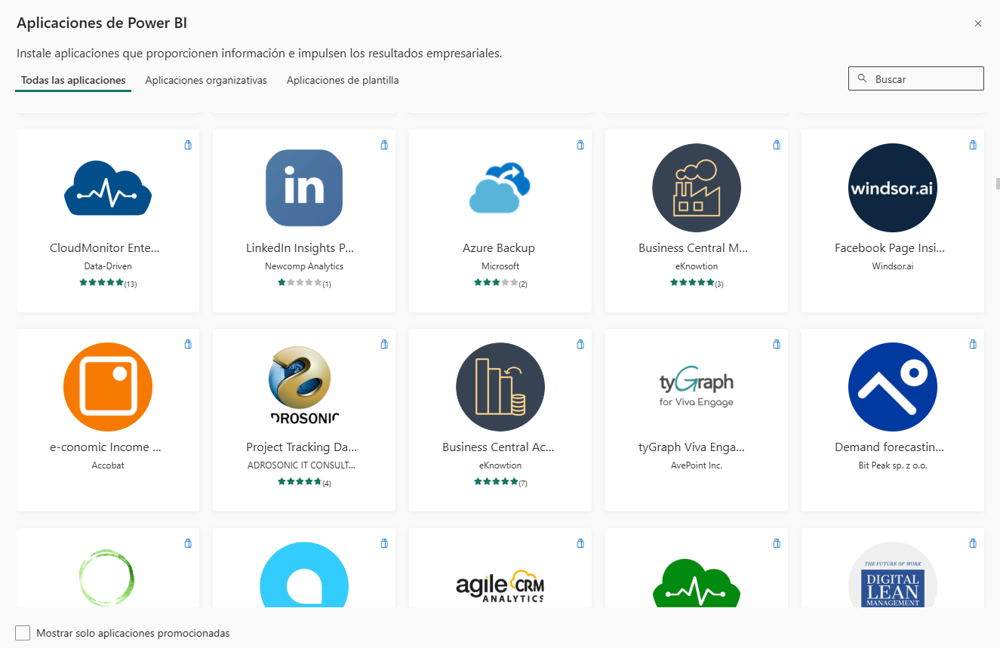
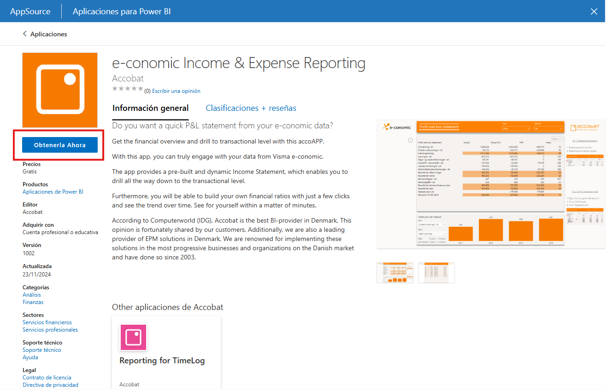
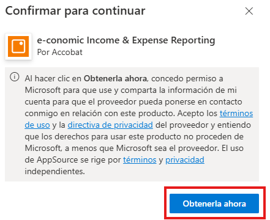

# Ejercicio #2

## Planteamiento del ejercicio.

>Como parte de las actividades de analista de Power BI, le piden examinar y dar su retroalimentación sobre un informe (Aplicación) que esté disponible dentro de Power BI Service. Esto con la idea de poder identificar ideas de diseño que puede aplicar a sus propios reportes, o bien, detectar errores que no quiere que lleguen a sus propios diseños.

### Objetivo

>El objetivo es analizar una aplicación de Power BI para exponer que elementos están bien aplicados y cuales tienen áreas de mejora.

### Tiempo estimado

>Dependiendo la aplicación y los hallazgos que haga dentro de su aplicación, podrá tardar más o menos tiempo, la idea es que se propone un tiempo de unos 50 minutos para poder realizar este ejercicio de forma exitosa.

### Actividades a realizar.

## Acceder al Servicio de Power BI.

Comenzaremos ingresando a servicio de Power BI con la cuenta proporcionada para realizar los ejercicios. Para ingresar al servicio de Power BI puedes usar la siguiente liga. https://app.powerbi.com/

Una vez ingreses, busca en el menú lateral izquierdo la opción de aplicaciones.

Ahora buscaremos la opción de obtener aplicaciones, la idea es que, desde este apartado, podemos adquirir aplicaciones de nuestra organización, o bien ejemplos que otros han desarrollado y han decidido compartir.

Como puedes observar, existen distintos ejemplos de aplicaciones que podemos analizar, la idea es que queda a elección del alumno, cuál será la aplicación que analizará, como sugerencia, se recomienda que la aplicación se relacione con el giro de la empresa en donde se encuentra, o por lo menos algo lo más parecido posible.

Como ejemplo de cómo adquirir una aplicación se muestra la siguiente captura de pantalla, solamente debemos hacer clic en Obtenerla Ahora.

Recuerda que instalar aplicaciones implica trabajar con componentes que, a menos que hayan sido desarrollador por nuestra organización, pudiesen representar un riesgo. Por lo que hay que tener cuidado de hacer esto con nuestra cuenta verdadera.

Una vez tengamos instalada la aplicación, comenzaremos con el proceso de análisis, la evidencia entregable para esta actividad es un documento de Word / Power Point donde se dejen sus observaciones y las capturas de pantalla de la aplicación analizada.

El análisis debe considerar factores como los colores, el aprovechamiento del espacio, la saturación de información, lo intuitivo que resulta entender los datos, lo relacionado que están los gráficos, la agrupación de estos, entre otra serie de factores que se mencionaron a lo largo del módulo.

Algunos de los análisis serán expuestos a los demás compañeros, por lo que es importante que consideres como vas a contar tus hallazgos, las áreas de mejora de la aplicación y que observaste que quisieras aplicar a tus reportes. 

