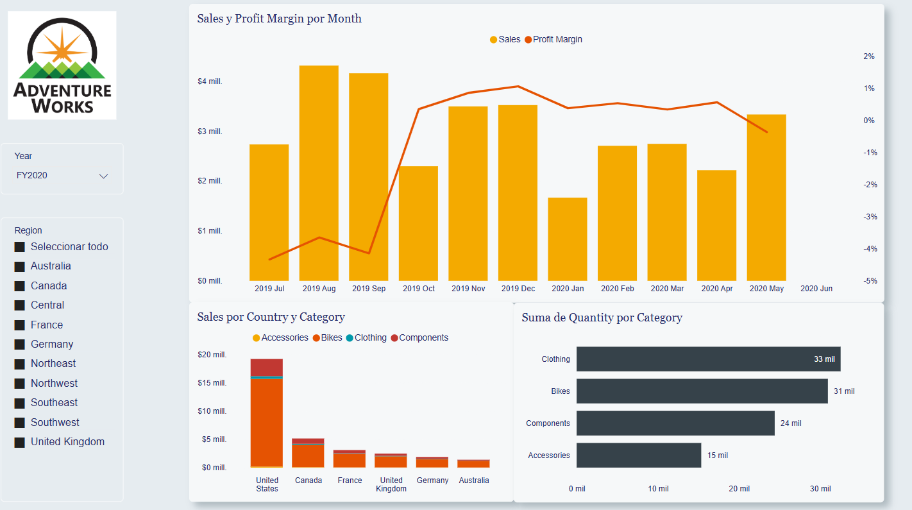
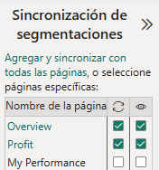
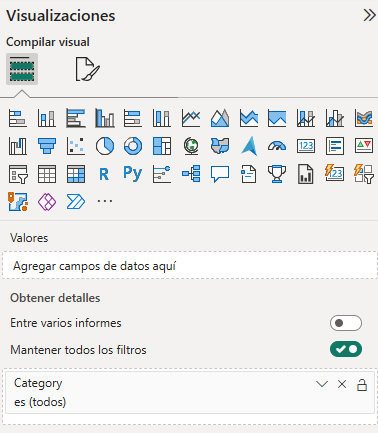
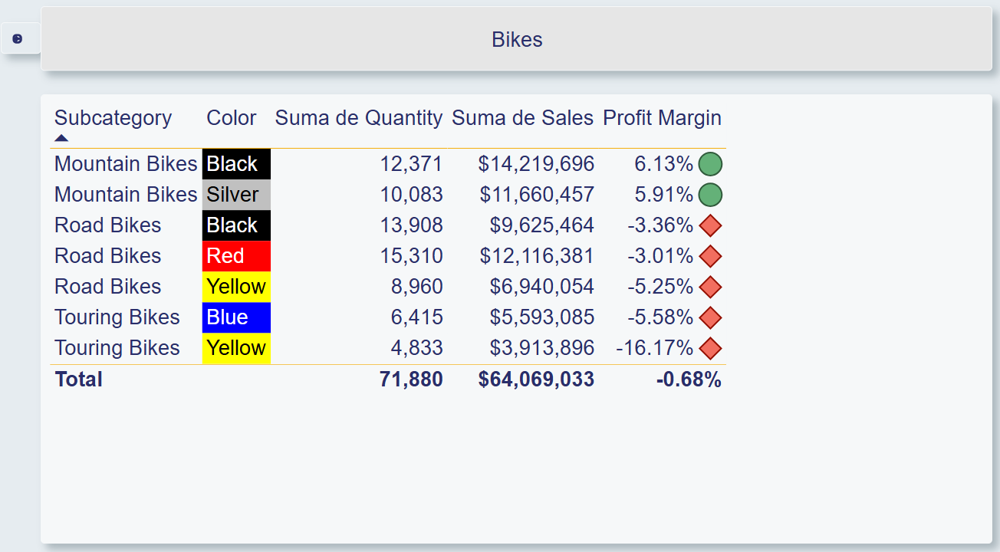
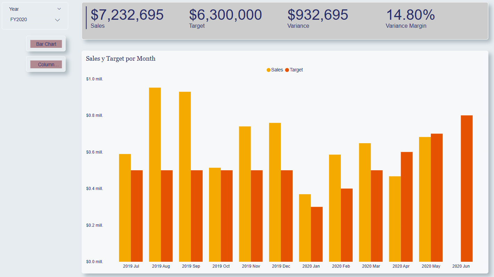

# Ejercicio #3

## Planteamiento del ejercicio.

>Como parte de las actividades de analista de Power BI, le piden examinar elaborar un informe de acuerdo a una base que ya ha realizado otro compañero. Este compañero ya se ha encargado de realizar la limpieza de los datos, el modelado de los mismos y agregado algunas medidas, jerarquias, carpetas entre otros elementos necesarios para elaborar el informe. Por lo que su unica función es elaborar el reporte de acuerdo a las especificaciones que le moenta la parte interesada.

### Objetivo

>El objetivo es realizar un reporte de Power BI apartir de una modelo semantico ya implementado.

### Tiempo estimado

>Dependiendo de la experiencia que tengamos con Power BI, algunas de estas acciónes serán mas faciles e intuitivas de hacer, mientras que para personas que no tienen mucha experiencia puede que les tome mas tiempo, la idea es que se propone un tiempo de unos 60 minutos para poder realizar este ejercicio de forma exitosa.

### Actividades a realizar.

Comenzaremos abriendo el archivo reporte_base, este archivo se encuentra en la carpeta documentos. Al abrir el archivo, lo primero que observaremos es que ya se tenemos toda la información y elementos listos para ser utilizados. Solamente nos tenemos que enfocar en la parte visual.

Por lo que lo primero será dar formato a todo el documento para que se adecue a cierto estilo de diseño. Por lo que iremos a la sección ver y buscaremos agregar un nuevo tema.

> Recuerda que puedes agregar un nuevo tema al momento de seleccionar la opción explorar temas, permitiendo agregar un tema personalizado como el de TemaCodelco.json, que se encuentra en igualmente en la carpeta documentos.

## Pagina Overview

A la primer pagina del reporte que vamos a realizar, la llamaremos overview, por lo que cambia el nombre de esta pagina para que pase de pagina 1, a overview.

Ahora lo primero que nos piden hacer en la pagina overvire, es agregar la imagen del logo de la empresa, el cual se encuentra en la carpeta documentos. Nos comentan que debe estar en la parte superior izquierda de la pagina de la primer pagina del reporte.

> Como referencia puedes usar la siguiente imagen para saber que ubicación y tamaño relativo deberia tener la imagen.

> Seguiremos usando la nomenclatura Tabla | Columna a lo largo de este laboratorio, por lo que recuerda esta sintaxis en los siguientes pasos cuando se indique que campos agregar.

Posteriormente, nos piden agregar un segmentador, para filtrar la información por Date | Year. El segmentador nos comentan que lo quieren personalizar para que sea un Menú Desplegable. Este objeto, lo pondremos justo debajo de la imagen del logo.

> Sigue como referencia la siguiente imagen.

Para este reporte, nos interesa ver la información para el año fiscal 2020.

Ahora nos piden agregar un segmentador, para filtrar la información por Region | Region. El segmentador nos comentan que lo quieren personalizar para que sea una Lista. Este objeto, lo pondremos justo debajo del objeto anterior.

> Sigue como referencia la siguiente imagen.

> Para la siguiente visualización, sigue de referencia la siguiente imagen.

Nos piden agregar una visualización de un grafico de columnas apiladas y de lineas. Este objeto visual debe medir las ventas por mes y el margen de beneficio. El grafico debe mostrar la información para todos los meses, tengan o no tengan datos asociados.

> Recuerda las funciones del eje X y Y, siendo una la variable independiente y la otra la variable dependiente respectivamente. Recuerda que los valores dentro de una visualización son "personalizables" por lo que podemos hacer opciones especificas para cada campo y alterar asi el comportamiento predeterminado, como por ejemplo no mostrar información de los meses que no tienen información.

> Date | Month  
Sales | Sales   
Sales | Profit Margin

> Para la siguiente visualización, sigue de referencia la siguiente imagen.

Nos piden agregar una visualización de un grafico de columnas apiladas. Este objeto visual debe medir las ventas por País. El grafico debe mostrar la leyenda de que categoria de Producto se esta mencionando.

> Region | Country  
Sales | Sales  
Product | Category

> Para la siguiente visualización, sigue de referencia la siguiente imagen.

Nos piden agregar una visualización de un grafico de barras apiladas. Este objeto visual debe medir la cantidad de ventas por categoria de Producto. El grafico debe las etiquetas de datos.

> Product | Category  
Sales | Quantity

> El resultado de la pagina overview deberia ser similar a la siguiente:

Ahora procederemos a crear una segunda pagina, la llamaremos Profit.

> Para la siguiente visualización, sigue de referencia la siguiente imagen.

Nos piden agregar un segmentador para filtrar por regiones, como existen multiples regiones, queremos facilitar el uso de este grafico, permitiendo la opcion de seleccionar todos los valores.

> Region | Region

> Para la siguiente visualización, sigue de referencia la siguiente imagen.

Nos piden agregar un objeto visual de matriz, donde nos interesa ver la información por una serie de fechas, año fiscal, trimetres o mes. Los datos que nos interesan son los siguientes: El conteo de ordenes, la suma de las ventas, la suma de los costos, el beneficio, y el margen del beneficio.

> Date | Fiscal  
Sales | Orders  
Sales | Cost  
Sales | Profit  
Sales | Profit Margin

Ahora nos piden agregar distintos filtros avanzados, por lo que no queremos que aparezcan en la interfaz grafica si no que se queden como filtros a nivel de pagina, los filtros serán: categoria del producto, subcategoria del producto, producto y color.

> El resultado final, debe ser algo parecido a lo siguiente.

Ahora trabajaremos con la tercer pagina del reporte, la llamaremos My Performance.

Si bien aun no se ha cubierto el concepto de RLS, la idea es que queremos filtrar el contenido que se muestra en función de un usuario en particular, por lo que usando los filtros avanzados, usaremos el criterio del desempeño de Salesperson y filtraremos por Michal Blythe.

> Para la siguiente visualización, sigue de referencia la siguiente imagen.

Nos piden agregar un segmentador para filtrar por año y pondremos de referencia el año 2019.

> Date | Year

> Para la siguiente visualización, sigue de referencia la siguiente imagen.

Nos piden agregar una tarjeta de varias filas que cubran los datos de las ventas, los objetivos de ventas, la varianza y el margen de la varianza. Nos piden aumentar el tamaño del texto a 28pt y que el fondo de esta visualización tenga un color gris claro (por ejemplo un blanco con 20% mas oscuro)

> Sales | Sales  
Targets | Target  
Targets | Variance  
Targets | Variance Margin

> Para la siguiente visualización, sigue de referencia la siguiente imagen.

Nos piden agregar un grafico de barras agrupadas, nos piden evaluar las ventas y los objetivos por mes.

> Date | Month  
Sales | Sales  
Targets | Target

Como no sabemos exactamente si esta visualización le resultará de agrado a los consumidores, crearemos una copia de esta visualización y la pegaremos, cambiando en el proceso el tipo de grafico para ahora ser grafico de columnas agrupadas.

Hasta este punto tenemos el esqueleto del reporte, pero nos falta añadir la funcionalidad avanzada y personalizar la interacción dentro del reporte.

Nos piden sincronizar el segmentador de los años, para que tanto para la pagina de overview y My performance siempre muestren la misma información cuando se apliquen los cambios en una pagina u otra.

> Toma de referencia la siguiente imagen para ver como quedó la configuración.

Haciendo lo mismo para la segmentación de regiones, sincronizando tanto la pagina de Overview y Profit.

> Toma de referencia la siguiente imagen para ver como quedó la configuración.

Ahora, queremos agregar una pagina de obtener detalles, para profundizar el analisis de la información.

Por lo que generaremos una nueva pagina que llamaremos Product Details.

Al ser esta una pagina para analisis "situacional" (es decir cuando se requiera mas información pero que no forma parte del flujo normal) marcaremos esta pagina como oculta.

Esta pagina será utiliada para obtener mas información en función de la categoria del producto por lo que agregaremos este campo a la información de la pagina.

> Puedes tomar de referencia la siguiente imagen para realizar esta configuración.

De momento, nos interesa solamente ver la información dentro de esta pagina solamente para la categoria de producto Bikes.

> Para la siguiente visualización, toma de referencia la siguiente imagen.

Nos piden agregar una visualizacion de tarjeta que tenga la información de la categoria del producto. Desmarcaremos la opción etiqueta de la categoria.Le pondremos un fondo de un tono gris, parecido a lo que hicimos en un paso anterior.

> Para la siguiente visualización, toma de referencia la siguiente imagen.

Nos piden agregar un objeto visual de tabla donde agregaremos los datos por analizar, los cuales son: la subcategoria del producto, el color del producto, la cantidad de ventas, el monto de las ventas, el margen de beneficios.

> Product | Subcategory   
Product | Color  
Sales | Quantity  
Sales | Sales  
Sales | Profit Margin  

De esta tabla, nos interesa aplicar el formato condicional para el margen de beneficio en función del valor que se tenga se muestra un icono u otro.

> Todo valor menor menor que 0, se debe mostrar un simbolo de, por ejemplo, un rombo de color rojo. Para los valores iguales o mayores a 0 un icono de un circulo de color verde.

Adicionalmente agregue el formato condicional para el fondo de una columna en función del texto la columna.

>Toma de referencia las columnas de Background Color Format y Font Color Format para este paso.

> El resultado deberia verse algo mas o menos parecido a lo siguiente.

Por ultimo nos piden generar dos marcadores, esto con el objetivo que, dependiendo cual marcador sea seleccionado se muestre un tipo de imagen u otra, en lugar de mostrar de forma ducplicada la información.

