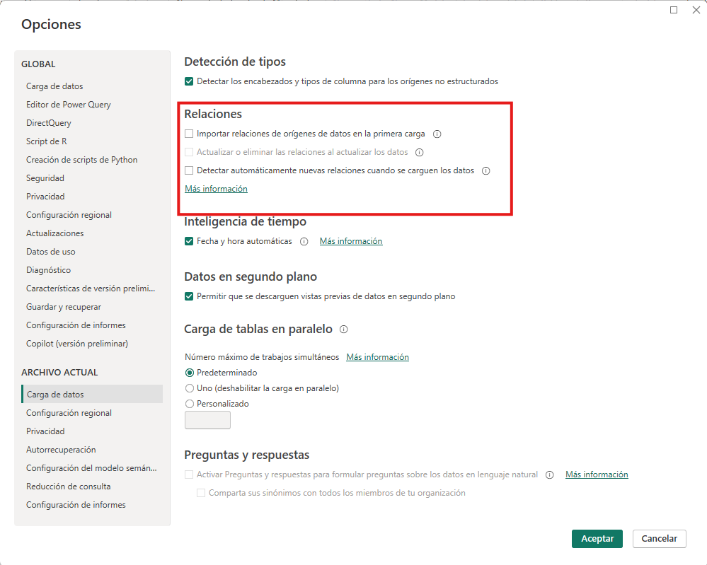
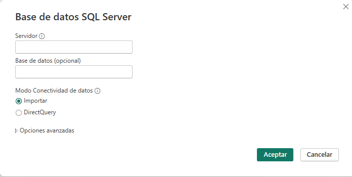
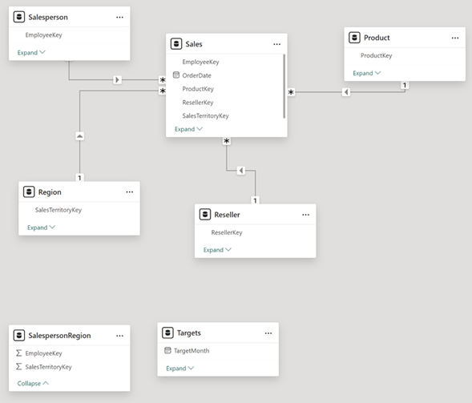
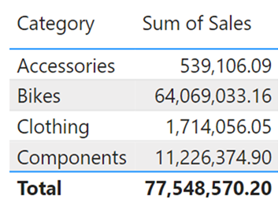
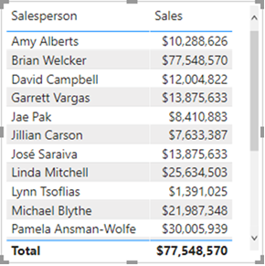

# Práctica 1. Optimización de un modelo de datos y aplicación de medidas DAX

## 📝 Planteamiento de la práctica:
Como parte de las actividades de desarrollo de un reporte, le piden descargar y modelar los datos dentro de la aplicación de Power BI Desktop. Entre las tareas que realizarás en este laboratorio se encuentran la extracción de los datos, el proceso de limpiar los datos y analizar las relaciones entre las tablas. Así como decidir si se conservan las tablas o se dejan de lado.

## 🎯 Objetivos:
Al finalizar la práctica, serás capaz de:
- Aplicar los conocimientos adquiridos a través de la realización de un mini proyecto que recorra, de forma consecutiva, las fases del proceso de desarrollo de un informe en Power BI.

## 🕒 Duración aproximada:
- 50 minutos.

## 🔍 Objetivo visual:


---

**[Lista general 🗂️](https://netec-mx.github.io/PBI_INT_Priv/)** | **[Siguiente ➡️](https://netec-mx.github.io/PBI_INT_Priv/Laboratorio_2.html)**

---

## Instrucciones:
### Configuración de Power BI
Para iniciar, configura la herramienta para evitar que, al seleccionar los orígenes de datos, se generen relaciones de forma automática. Para ello, abre Power BI y ve a **Archivo ➡️ Opciones y configuración ➡️ Opciones ➡️ Carga de datos**. Luego, desmarca las opciones relacionadas con la creación automática de relaciones.



## Acceso a los orígenes de los datos

Un usuario te solicita obtener información desde la base de datos **AdventureWorksDW2020**. Además, te comenta que no es necesario obtener información en tiempo real y que prefiere evitar saturar al servidor con consultas de la base datos.



Al configurar la conexión al origen de datos para obtener la información de las siguientes tablas:

* DimEmployee
* DimEmployeeSalesTerritory
* DimProduct
* DimReseller
* DimSalesTerritory
* FactResellerSales

Antes de cargar toda la información al modelo semántico de Power BI, es importante que analices las columnas y los valores que vas a importar. En ese sentido, explora los valores de las distintas tablas y realiza las operaciones dentro de cada una de ellas:

* **DimEmployee** (almacena una fila para cada empleado):  
    * Te piden realizar la transformación necesaria para renombrar la consulta a `Salesperson`.
    * De esta forma, la tabla debe contener solo los registros de vendedores, y no de otros roles dentro de la empresa. Para ello, filtra los registros y deja solamente aquellos correspondientes a vendedores.

> 💡 ***Nota:** Puedes usar la columna **SalesPersonFlag**, el cual puede ser útil para realizar este filtrado.*

Además, te solicitan que la tabla conserve únicamente las siguientes columnas:
   * EmployeeKey
   * EmployeeNationalIDAlternateKey

> 💡 ***Nota:** Sería buena idea cambiar el nombre de esta columna por algo más amigable para el usuario. Por ejemplo, puedes renombrar el identificador a `EmployeeID`.*

   * FirstName
   * LastName
   * Title
   * EmailAddress 
        
En ciertos contextos, la dirección de correo electrónico puede identificarse con las siglas UPN. Para mantener la consistencia, renombra esta columna a **UPN**.

Por otro lado, también te piden combinar las columnas **FirstName** y **LastName**. La columna nueva se debe llamar `Salesperson`.

* **DimEmployeeSalesTerritory** (contiene el territorio que maneja un vendedor):
    * También, te piden renombrar esta consulta a `SalespersonRegion`.
    * Además, elimina las columnas **DimEmployee** y **DimSalesTerritory**.

* **DimProduct** (contiene una fila por producto vendido por la empresa):
    * Te solicitan renombrar la consulta a `Product`.
    * De la información a modelar, solo son relevantes aquellos productos que están terminados.

Observa la columna **FinishedGoodsFlag**, la cual puede ser útil para realizar este filtrado.

Conserva las siguientes columnas:

* ProductKey
* EnglishProductName, que las renombrarás como `Product`.
* StandardCost, que las renombrarás como `Standard Cost`.
* Color
* DimProductSubcategory, que las renombrarás como `Subcategory`.

Expande la columna **DimProductSubcategory**, y deja solamente las columnas:
* EnglishProductSubcategoryName
* DimProductCategory
            
Las columnas no tendrán ningún prefijo.

Además, te piden realizar la misma acción para la columna **DimProductCategory**; de esta forma, solo deja la columna **EnglishProductCategoryName**, que las renombrarás **Category**.

- **DimReseller** (contiene una fila por revendedor; los revendedores venden, distribuyen o agregan valor a los productos).

Renombra la consulta a `Reseller`.

En la consulta, solamente deja las siguientes columnas:
        
   * ResellerKey
   * BusinessType: renóbrala para incluir un espacio.
   * ResellerName, que las renombrarás como `Reseller`.
   * DimGeography
    
En esta última columna, te solicitan expandirla para dejar únicamente los valores de las siguientes columnas:

* City
* StateProvinceName
* EnglishCountryRegionName la renombraremos como Country-Region

Analiza los valores de la columna Business Type. ¿Notas algo raro? Realiza los cambios necesarios en esta columna para garantizar la integridad de la información en todos los registros.
            
Recuerda que los valores se consideran distintos si no contienen exactamente los mismos caracteres. Por ejemplo, **Warehouse** y **Ware house** no son iguales.

**DimSalesTerritory** (contiene una fila por cada región de ventas. Las regiones se asignan a un país, y los países a su vez a grupos)
    
* Renombra la consulta a `Region`.
* Observa que hay un registro con valor 0 en la columna

**SalesTerritoryAlternateKey**. Posteriormente, procede a eliminar ese registro.

En la consulta, conserva únicamente las siguientes columnas:
    
* SalesTerritoryKey
* SalesTerritoryRegion, que las renombrarás como `Region`.
* SalesTerritoryCountry, que las renombrarás como `Country`.
* SalesTerritoryGroup, que las renombrarás como `Group`.

**FactResellerSales** (contiene una fila por cada línea de pedido de ventas. Un pedido puede tener uno o más elementos de línea).

* Renombra esta consulta como `Sales` para identificarla de manera más clara.
* El equipo necesita únicamente la información contenida en las siguientes columnas:
  * SalesOrderNumber
  * OrderDate
  * ProductKey
  * ResellerKey
  * EmployeeKey
  * SalesTerritoryKey
  * OrderQuantity, que renombrarás como `Quantity`.
  * UnitPrice,  al que debes renombrar para agregar un espacio en el nombre para mejorar su legibilidad.
  * TotalProductCost
  * SalesAmount, que renombrarás como `Sales`.
  * DimProduct

De la columna **DimProduct**, solo necesitamos obtener el costo de cada producto. Para ello:

- Expande la columna **DimProduct** y deja únicamente el valor de la columna **StandardCost**.

Ahora que ya tienes el valor del costo y la cantidad de unidades vendidas, podemos calcular el monto total de esas operaciones. En caso de que haya valores vacíos en los registros, vamos a crear una nueva columna calculada llamada Cost con la siguiente fórmula:

```
if [TotalProductCost] = null then [Quantity] * [StandardCost] else [TotalProductCost]
```

Este valor calculado nos resulta más útil que los que están almacenados en las columnas **TotalProductCost** y **StandardCost**, por lo tanto, puedes eliminar esas dos columnas.

Ahora reflexiona y revisa lo siguiente:

* ¿Los productos que se venden son una unidades discretas?
* ¿El tipo de dato de la columna se adapta a este tipo de información?
* Realiza los cambios necesarios para que el tipo de dato coincida con el tipo de información. 

Haz este mismo análisis para las columnas Unit Price, Sales y Cost, y ajusta sus tipos de datos si es necesario.

Adicionalmente a realizar estas acciones, nos comentan que hay información adicional que no está en la base de datos, para ello vamos a agregar los datos desde estos 2 archivos al modelo semántico, estos archivos se encuentran en la carpeta **Documentos**.

**ResellerSalesTargets** (contiene una fila por vendedor y por año. Las ventas objetivo están representadas en miles).

**¿Qué notas en los meses donde no hay ventas?**

- Por la estructura de la tabla, es necesario anular la dinamización de las columnas para que la información sea más fácil de manipular.

    > 💡 ***Nota:** Recuerda que puedes seleccionar columnas como **Year** y **EmployeeID**, y luego anular la dinamización de las demás columnas.*

- Filtra los valores que no tengan valores en la columna de **Value**.
- Renombra la columna **Attribute** como `MonthNumber`, y **Value** como `Target`.
- Verifica si los valores en la columna MonthNumber contienen solo el número del mes. Si no es así, reemplaza el texto adicional para que solo quede el número del mes.
- En la pestaña Agregar columna, dentro del grupo General, selecciona el icono Columna de ejemplos. 
- Observa que la primera fila corresponde al año 2017 y al mes número 7. 
- En la primera celda de la columna **Columna1**, comienza a escribir `1/7/2017` y presiona **Enter**. Verás cómo las demás celdas se autocompletan con los valores esperados.
- Renombra la columna generada como `TargetMonth` y asegúrate de cambiar su tipo de dato a fecha.
- Elimina las columnas **Year** y **MonthNumber**.
- Cambia el tipo de dato de la columna Target a decimal.
- Como ahora se requiere ver los números completos (recuerda que originalmente estaban representados en miles), multiplica los valores de la columna **Target** por 1000.

**ColorFormats** (contiene una fila por color de producto).

> 🧠 **¿Los encabezados de las columnas son correctos?** Si no lo son, promueve la primera fila como encabezados.

Ahora que ya tenemos todos los datos necesarios en el modelo semántico, vamos a modificar la consulta **Product**. Para ello, vamos a crear una relación entre esta tabla y la tabla **ColorFormats**.

Como en este caso queremos combinar valores de dos tablas que no tienen las mismas columnas, ¿qué tipo de operación deberías usar para mezclar los valores de ambas?

> 💡 ***Nota**: Recuerda:*
> - *Si las consultas son muy parecidas y quieres agregar datos de una a otra, puedes usar combinar consultas.*
> - *Si los datos son distintos pero están relacionados por una columna común, puedes usar una combinación (merge) basada en esa relación.*

Después de crear la relación entre las dos tablas:
- Expande la columna relacionada de **ColorFormats** dentro de la consulta **Product**.
- Conserva únicamente las columnas **Background Color Format** y **Font Color Format**.

Ahora que la tabla Product ya incluye toda la información de los colores del producto, pregúntate:

- **¿Es necesario seguir cargando al modelo semántico los datos de la consulta _ColorFormats_?**

> 🧠 _No siempre es necesario. Si la tabla solo fue utilizada como puente para enriquecer otra consulta, puedes deshabilitar su carga al modelo._

Finalmente, ya que los datos se han cargado correctamente en el modelo semántico, vamos a editar las relaciones entre las tablas según sea necesario.

> 💡 ***Nota**: A partir de este punto, se usará la nomenclatura Tabla - Columna para identificar con precisión los datos mencionados.*

Vamos a realizar un análisis sencillo que muestre la suma de las ventas por categoría de producto. Hasta ahora, nos han solicitado usar un gráfico que muestre la información en un formato similar a una tabla.

Puedes usar los datos de:
- Sales
- Sales y Product
- Category

**Reflexiona:**
* ¿Qué notas en esta tabla?
* ¿Todos los valores son iguales o hay diferencias entre ellos?

El resultado dependerá de si existe o no una relación.

Ve a la vista de modelo para verificar cómo están definidas las relaciones. Si aún no existe una relación entre **Product** y **Sales**, créala ahora.

La nueva relación debe ir de **Product** - **ProductKey a Sales** - **ProductKey**, en una relación de **uno a muchos**, lo que nos permite buscar el número de ventas por producto.

Al revisar las relaciones existentes, surge la siguiente pregunta:

- **¿Hay una forma más interactiva de crear relaciones usando el entorno gráfico de la vista de modelo?**

Sí. En la vista de modelo, puedes arrastrar un campo desde una tabla hacia otra para crear la relación. Por ejemplo:

Arrastra **Reseller** - **ResellerKey** hacia **Sales** - **ResellerKey** para establecer una relación de uno a muchos, lo que te permitirá consultar las ventas por revendedor.

De forma similar, usando cualquiera de estas técnicas, ahora debes:
- Unir las tablas de Region y de Salesperson con la tabla de Sales.

**Region** l **SalesTerritoryKey** a **Sales** l **SalesTerritoryKey** y **Salesperson** l **EmployeeKey** a **Sales** l **EmployeeKey**

Hasta este punto, tu modelo debería verse similar a lo siguiente:



Puedes confirmar que las relaciones se han aplicado correctamente, ya que al comparar los datos con la tabla de referencia, estos deberían haberse actualizado y reflejarse como se muestra en la siguiente imagen:



Ahora, te solicitan crear una forma de explorar la información a distintos niveles. Por ejemplo, les interesa ver los datos a nivel de categoría de **producto**, **subcategoría** y **producto**.

- Puedes crear una jerarquía desde **Product** l **Category** en el panel de datos.
- Agrega los distintos niveles y renombra la jerarquía como `Products`.
- No olvides aplicar los cambios.

También nos solicitan organizar de manera más clara los campos dentro de las tablas. Por ejemplo, agrupar:
- **Background Color Format** y **Font Color Format** en un folder llamado `Formatting`.

Ahora el usuario requiere un proceso  similar a lo realizado con la jerarquía, pero en este caso utilizando los valores: **Region** l **Group, Region** l **Country y Region** l **Region**. 

Verifica en esta tabla que el campo **Country** esté correctamente marcado como **Country/Region** en los metadatos.

> 💡 ***Nota**: Recuerda que la información del campo se encuentra en el panel, dentro de la sección de Avanzado.*

Ahora, el usuario requiere la creación de dos nuevas jerarquías: 
1. Dentro de tabla **Reseller** crea una jerarquía llamada Resellers con los niveles:
   - Business Type
   - Reseller
2. En jerarquía será Geography, incluye los niveles:
   - Country-Region
   - State-Province
   - City.

Verifica los metadatos de cada campo para asegurarte de que sean tratados de forma adecuada de acuerdo con el nivel de información que se maneja en cada uno de ellos.

Posteriormente, te solicitan editar algunas propiedades desde la tabla de **Sales**.

> 💡 ***Nota**: Esto lo puedes realizar desde el **panel de propiedades**.*

- Te piden que la descripción de la columna **Costo** describa cómo es que se calculó; es decir, agrega un texto: calculado a partir del costo estándar de un producto.
- Además, configura que la columna **Quantity** tenga un separador de miles.
- Ajusta la columna de **Unit Price** para que tenga dos decimales y se muestre como promedio.

Regresando a la interacción de los datos, te piden ocultar ciertas columnas al momento de dibujar el reporte; sin embargo, son necesarias para las relaciones entre las tablas. 

* Product | ProductKey
* Region | SalesTerritoryKey
* Reseller | ResellerKey
* Sales | EmployeeKey
* Sales | ProductKey
* Sales | ResellerKey
* Sales | SalesOrderNumber
* Sales | SalesTerritoryKey
* Salesperson | EmployeeID
* Salesperson | EmployeeKey
* Salesperson | UPN
* SalespersonRegion | EmployeeKey
* SalespersonRegion | SalesTerritoryKey
* Targets | EmployeeID

Configura las siguientes columnas para que tengan 0 decimales. Puedes hacerlo usando una configuración similar a la del paso anterior.

* Product | Standard Cost
* Sales | Cost
* Sales | Sales

Por otro lado, el usuario está interesado en contar con una serie de valores ya calculados para analizar las ganancias, el porcentaje de ganancias y otros indicadores clave. Para ello, vamos a crear varias medidas.

- En la parte de **Cálculo**, selecciona **Restar**.
- En la parte de **Datos**, el valor base será **Sales** y el valor a restar será **Cost**.
- Ahora, renombra esa medida como `Profit`.

Luego, crea una nueva medida rápida llamada Profit Margin, que calcule el porcentaje de ganancia tomando como referencia el paso anterior.

Prueba los valores en un gráfico de tablas.

Ahora, genera una tabla (gráfico de tipo tabla) con los siguientes valores:
- Salesperson | Salesperson
- Sales | Sales 

Observa los valores que tiene cada vendedor.

> 💡 ***Nota**: Ten en cuenta que, dependiendo de la relación que se esté utilizando para analizar la información, estos valores pueden cambiar.*

Finalmente, te solicitan crear las siguientes relaciones para analizar los datos desde otra perspectiva:

- **Salesperson l EmployeeKey** a **SalespersonRegion l EmployeeKey**.
- **Region l SalesTerritoryKey** a **SalespersonRegion l SalesTerritoryKey**.

Una vez creadas, vuelve a observar el gráfico.
- **¿Los valores cambiaron?**
- **¿Qué crees que pueda estar causando que no se actualicen correctamente?**

> 💡 ***Nota**: Recuerda que la direccionalidad de la relación influye en qué tabla afecta a otra.*

Edita la relación existente entre Region y SalespersonRegion para que funcione en ambos sentidos. **¿Aun así los valores no cambian?**

Reflexiona: **¿por qué crees que está ocurriendo esto?**

> 💡 ***Nota**: Recuerda que las relaciones pueden estar activas o inactivas. Verifica que esta nueva forma de ver los datos esté habilitada como la ruta principal.*

Ahora, cambia el nombre de la tabla **Salesperson** a `Salesperson (Performance)`.

Para terminar, te piden crear última relación por el momento entre:
- Salesperson (Performance) | EmployeeID y Targets | EmployeeID.

## Resultado esperado: 

Los valores ahora deberían verse así



---

**[Lista general 🗂️](https://netec-mx.github.io/PBI_INT_Priv/)** | **[Siguiente ➡️](https://netec-mx.github.io/PBI_INT_Priv/Laboratorio_2.html)**

---
