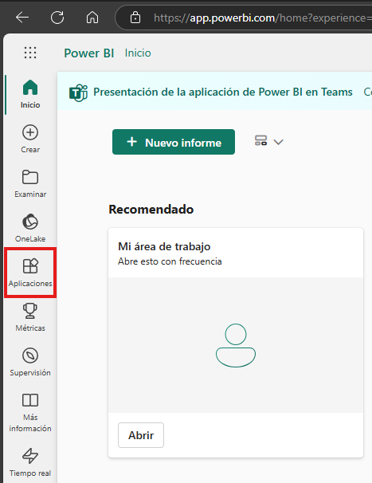
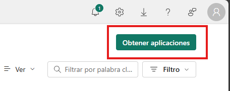
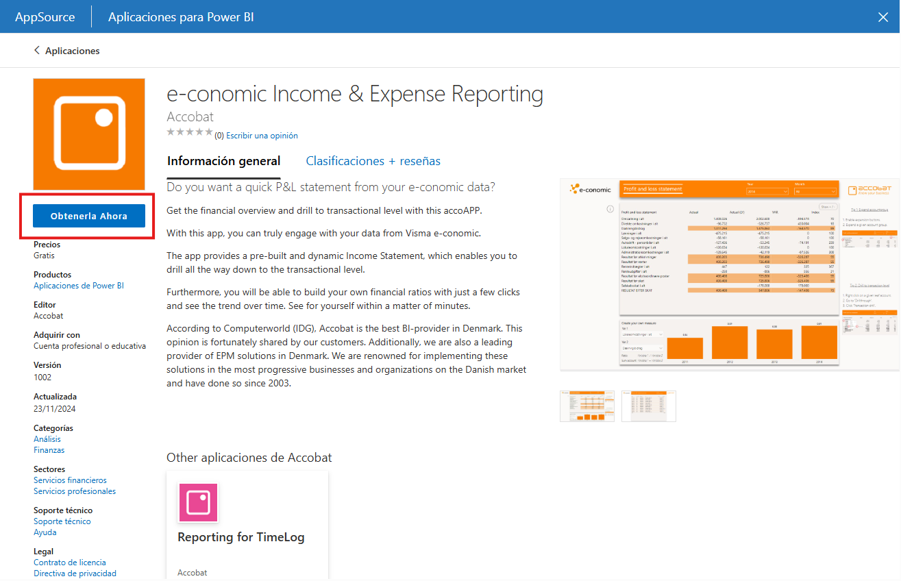
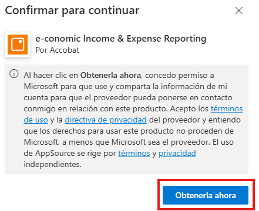
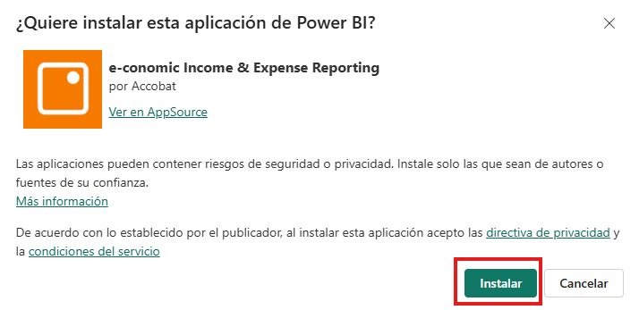

# Práctica 2. Rediseño de informe: Aplicación de storytelling

## 📝 Planteamiento de la práctica:
Como parte de tus actividades como analista de Power BI, se te pide examinar y dar retroalimentación sobre un informe (o aplicación) disponible dentro de Power BI Service.

El propósito de esta actividad es que puedas:
- Identificar ideas de diseño que puedas aplicar en tus propios reportes.
- Detectar errores o malas prácticas que te gustaría evitar en tus propios diseños.

## 🎯 Objetivos:
Al finalizar la práctica, serás capaz de:
- Analizar una aplicación de Power BI para identificar qué elementos están bien aplicados y cuáles tienen áreas de mejora.

## 🕒 Duración aproximada:
- 60 minutos.

## 🔍 Objetivo visual:

---

**[⬅️ Atrás](https://netec-mx.github.io/PBI_INT_Priv/Laboratorio_1.html)** | **[🗂️ Lista general](https://netec-mx.github.io/PBI_INT_Priv/)** | **[Siguiente ➡️](https://netec-mx.github.io/PBI_INT_Priv/Laboratorio_3.html)**

---

## Instrucciones:

### Acceder al Servicio de Power BI:

1. Primero, ingresa al servicio de Power BI con la cuenta que se te proporcionó para realizar los ejercicios. Puedes usar la siguiente liga: [https://app.powerbi.com/](https://app.powerbi.com/)
2. Una vez que hayas ingresado, busca en el menú lateral izquierdo la opción **Aplicaciones**.
    
3. Ahora busca la opción Obtener aplicaciones. Desde ahí, puedes conseguir aplicaciones creadas por tu organización o explorar ejemplos que otras personas han desarrollado y decidido compartir.
    
4. Como puedes observar, existen distintos ejemplos de aplicaciones que puedes analizar. La elección queda a tu criterio, pero como sugerencia, te recomendamos escoger una aplicación que esté relacionada con el giro de la empresa en la que trabajas, o al menos con algo lo más parecido posiblee.
  
  > Como ejemplo de cómo adquirir una aplicación, a continuación se muestra una captura de pantalla. Solo debes hacer clic en **Obtenerla ahora**.
  
  
  > 💡 ***Nota:** Recuerda que instalar aplicaciones implica trabajar con componentes que, a menos que hayan sido desarrollados por tu organización, podrían representar un riesgo. Por eso, ten cuidado al hacerlo con tu cuenta real.*
  
5. Una vez que tengas instalada la aplicación, comenzarás con el proceso de análisis. La evidencia que debes entregar para esta actividad es un documento en Word o PowerPoint donde incluyas tus observaciones y las capturas de pantalla de la aplicación que analizaste.

El análisis debe considerar factores como los colores, el aprovechamiento del espacio, la saturación de información, lo intuitivo que resulta entender los datos, la relación entre los gráficos, la forma en que están agrupados, entre otros aspectos que vimos a lo largo del capítulo.

Algunos de estos análisis serán expuestos a tus compañeros, así que es importante que pienses en cómo vas a contar tus hallazgos, qué áreas de mejora identificaste en la aplicación y qué elementos observaste que te gustaría aplicar en tus propios reportes.

---

**[⬅️ Atrás](https://netec-mx.github.io/PBI_INT_Priv/Laboratorio_1.html)** | **[🗂️ Lista general](https://netec-mx.github.io/PBI_INT_Priv/)** | **[Siguiente ➡️](https://netec-mx.github.io/PBI_INT_Priv/Laboratorio_3.html)**

---
