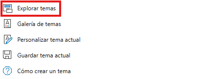
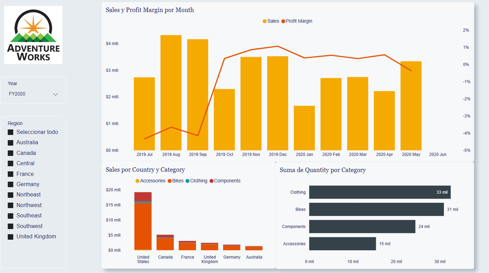
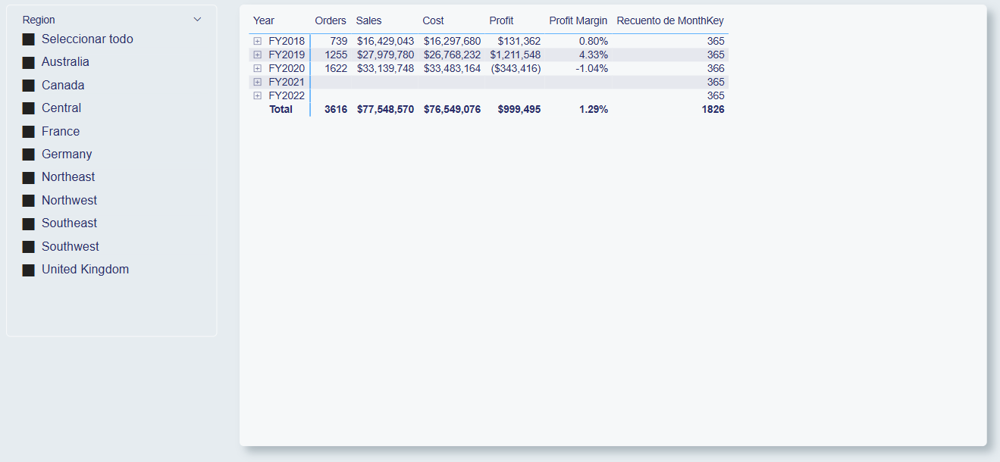
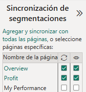
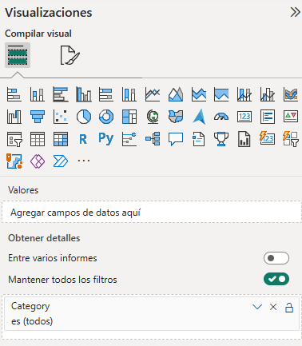
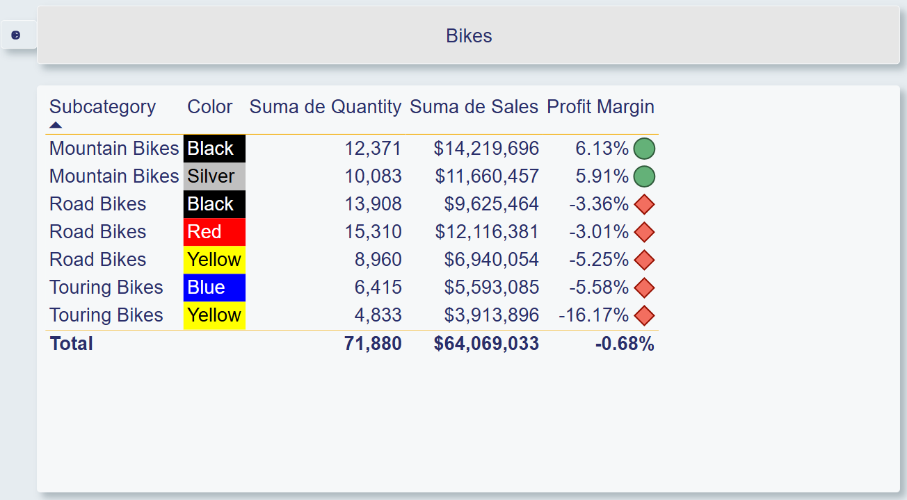
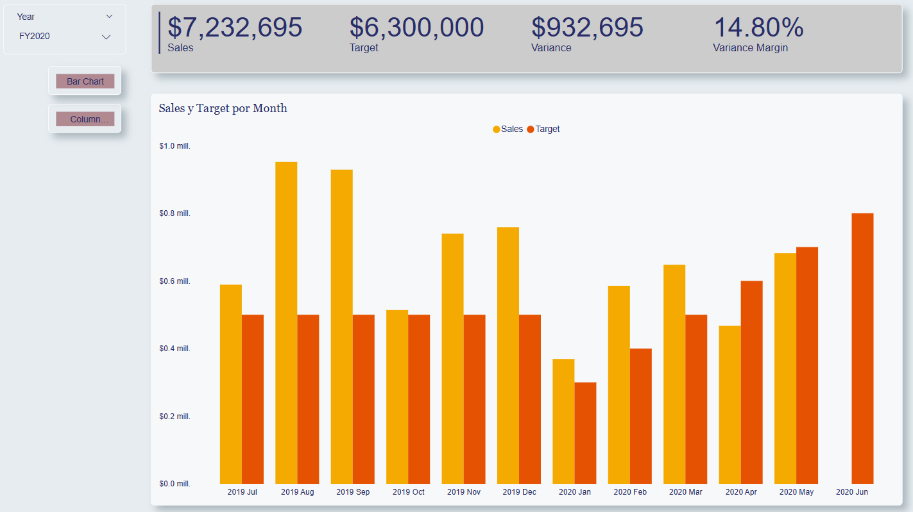

# Práctica 3. Diseño de informe con navegación y visualizaciones interactivas

## 📝 Planteamiento de la práctica:
Como parte de tus actividades como analista de Power BI, te solicitan elaborar un informe a partir de una base de datos que ya ha sido trabajada por otro compañero. Esta persona ya se encargó de limpiar los datos, modelarlos y agregar algunas medidas, jerarquías, carpetas y otros elementos necesarios para construir el informe. Por lo tanto, tu única función será diseñar el reporte según las especificaciones que te indique la parte interesada.

## 🎯 Objetivos:
Al finalizar la práctica, serás capaz de:
- Elaborar un reporte en Power BI a partir de un modelo semántico ya implementado.

## 🕒 Duración aproximada:
- 60 minutos.

## 🔍 Objetivo visual:

---

**[⬅️ Atrás](https://netec-mx.github.io/PBI_INT_Priv/Laboratorio_2.html)** | **[🗂️ Lista general](https://netec-mx.github.io/PBI_INT_Priv/)** | **[Siguiente ➡️](https://netec-mx.github.io/PBI_INT_Priv/Laboratorio_4.html)**

---

## Instrucciones:

Comienza abriendo el archivo **reporte_base**, que se encuentra en la carpeta **Documentos**. Al abrirlo, verás que ya tienes toda la información y los elementos listos para usar. Así que tu única tarea será enfocarte en la parte visual.

Lo primero que debes hacer es darle formato a todo el documento para que se ajuste a un estilo de diseño definido. Para eso, ve a la pestaña **Ver** y elige la opción para agregar un nuevo tema.

  > 💡 ***Nota:** Recuerda que puedes agregar un nuevo tema al momento de seleccionar la opción explorar temas, permitiendo agregar un tema personalizado como el de TemaCodelco.json, que se encuentra en igualmente en la carpeta documentos.*

## Página Overview

A la primera página del reporte que vas a crear nómbrala **Overview**, así que cambia el nombre de la página de **Página 1** a **Overview**.
Lo primero que te piden hacer en la página Overview es agregar el logotipo de la empresa, el cual se encuentra en la carpeta **Documentos**. Te indican que debe colocarse en la esquina superior izquierda de la primera página del reporte.  

  > 💡 ***Nota:** Como referencia, puedes usar la siguiente imagen para guiarte en la ubicación y el tamaño aproximado que debería tener el logotipo.*  

   

  > 💡 ***Nota:** Continúa usando la nomenclatura **Tabla l Columna** a lo largo de este laboratorio, así que mantén esta sintaxis en los siguientes al agregar campos.*  

A continuación, te piden agregar un segmentador para filtrar la información por **Date l Year**. Este segmentador debe personalizarse como un Menú desplegable y colocarse justo debajo de la imagen del logo. 

  > 💡 ***Nota:** Sigue como referencia la siguiente imagen.*  
  
    

  Para este reporte, lo relevantes es visualizar la información para el año fiscal 2020.  

Ahora, te solicitan añadir un segmentador para filtrar la información por **Region l Region**, el cual debe ser personalizado para que sea una **Lista** y colocarlo debajo del objeto anterior.

  Toma como referencia la siguiente imagen.  

    
  Para la siguiente visualización, toma como referencia la siguiente imagen.  
    

También te piden añadir una visualización de tipo gráfico de columnas apiladas y líneas combinadas. Este objeto visual debe medir las ventas por mes y el margen de beneficio. El gráfico debe incluir todos los meses, tengan o no datos asociados.   

  > 💡 ***Nota:** Recuerda cómo funcionan los ejes X y Y: el eje X representa la variable independiente. Ten en cuenta que los valores dentro de una visualización son **"personalizables"**, por lo que puedes ajustar opciones específicas para cada campo. Por ejemplo, puedes modificar el comportamiento predeterminado para que sí se muestren todos los meses, incluso si no tienen datos.*  

  - Date l Month  
  - Sales l Sales  
  - Sales l Profit Margin  

  Para la siguiente visualización, toma como referencia la siguiente imagen.  

    

Ahora te piden agregar una visualización de tipo gráfico de columnas apiladas. Este gráfico debe mostrar las **ventas por país** y, además, incluir una leyenda que indique a qué categoría de producto se está mencionando.  

  - Region l Country  
  - Sales l Sales  
  - Product l Category  

  Para la siguiente visualización, toma como referencia la siguiente imagen.  

    

También te dolicitan agregar una visualización de un grafico de barras apiladas. Este gráfico debe mostrar las **ventas por categoría de producto** y, además, debe incluir las etiquetas de datos.  
  
  - Product l Category    
  - Sales l Quantity  

  El resultado de la pagina overview deberia ser similar a la siguiente imagen:  
  
    

Procede a crear una segunda pagina, la cual debes nombrar **Profit**.  

Para la siguiente visualización, toma como referencia la siguiente imagen.  

    

Te piden agregar un segmentador para filtrar la información por regiones. Como existen múltiples regiones, queremos facilitar el uso de este filtro activando la opción de seleccionar todos los valores.

  - Region l Region  

  Para la siguiente visualización, toma como referencia la siguiente imagen.  
  
    

Te piden agregar un objeto visual de matriz, en el que se desea mostrar la información organizada por fechas, año fiscal, trimestres o mes. Los datos que deben incluirse en la matriz son los siguientes:  
  - El conteo de ordenes  
  - La suma de las ventas  
  - La suma de los costos  
  - El beneficio  
  - El margen del beneficio  

- Date l Fiscal
- Sales l Orders
- Sales l Cost
- Sales l Profit
- Sales l Profit Margin

Además, te solicitan agregar filtros avanzados, pero estos no deben mostrarse en la interfaz gráfica, sino que deben configurarse como filtros a nivel de página. Los campos a usar como filtros son:

- Product l Category
- Product l Subcategory
- Product l Product
- Product l Color

Para la siguiente visualización, toma como referencia la siguiente imagen.

Ahora trabajarás con la tercera página del reporte, la cual llamaremos `My Performance`.

Aunque todavía no se ha cubierto el concepto de RLS, la idea es filtrar el contenido mostrado en función de un usuario específico. Para lograrlo, utilizarás los filtros avanzados y usa el criterio del desempeño de **Salesperson** y filtra por _Michal Blythe_.

Para la siguiente visualización, toma como referencia la siguiente imagen.

Además, te piden agrega un segmentador para filtrar la información por año, tomando como referencia el año **2019**.

  - Date l Year

Para la siguiente visualización, toma como referencia la siguiente imagen.

Te piden agregar una tarjeta de varias filas que muestre los siguientes datos de las ventas, los objetivos de ventas, la varianza y el margen de la varianza.

Además, debes aumentar el tamaño del texto a 28 pt y configurar el fondo de la visualización con un color gris claro, por ejemplo, un blanco con un 20 % más de oscuridad.

  - Sales l Sales
  - Targets l Target
  - Targets l Variance
  - Targets l Variance Margin

  Para la siguiente visualización, toma como referencia la siguiente imagen.

Te piden agregar un gráfico de barras agrupadas para evaluar las ventas y los objetivos de ventas por mes.

  - Date l Month
  - Sales l Sales
  - Targets l Target

Como no sabemos con certeza si esta visualización será del agrado de los usuarios, vamos a crear una copia del gráfico de barras agrupadas que acabas de realizar. Luego, pégala en la misma página y cambia el tipo de visualización a un gráfico de columnas agrupadas.

  

Hasta este punto ya tienes el esqueleto del reporte, pero aún falta añadir funcionalidad avanzada y personalizar la forma en que interactúan los elementos dentro del informe.

Uno de los siguientes pasos es sincronizar el segmentador de años, de modo que tanto en la página **Overview** como en **My Performance** se muestre la misma selección cuando apliques un filtro en cualquiera de las dos páginas.

  Para la siguiente visualización, toma como referencia la siguiente imagen.

Realiza el mismo proceso para la segmentación de regiones, pero ahora sincronizando tanto la pagina de **Overview** como la de **Profit**.

  Para la siguiente visualización, toma como referencia la siguiente imagen.

  

Ahora vamos a agregar una nueva página para obtener detalles y profundizar el análisis de la información. Para ello, crea una nueva página y asígnale el nombre `Product Details`.

Dado que esta es una página para análisis "situacional" (es decir, solo se usa cuando se necesita más información y no forma parte del flujo normal del reporte), debes marcarla como oculta.

Esta página se utilizará para obtener más detalles según la categoría del producto, por lo que deberás agregar este campo a la información de la página.

  Para la siguiente visualización, toma como referencia la siguiente imagen.

Por ahora, solo nos interesa ver la información de esta página para la categoría de producto "Bikes".

  Para la siguiente visualización, toma como referencia la siguiente imagen.

Te piden agregar una visualización de tarjeta que muestre la categoría del producto. En esta tarjeta, deberás desmarcar la opción **Etiqueta de categoría**. Además, así como hiciste en un paso anterior, debes configurar un fondo de tono gris claro.

  Para la siguiente visualización, toma como referencia la siguiente imagen.

Te piden agregar un objeto visual de tabla que incluya los siguientes datos para su análisis: la subcategoria del producto, el color del producto, la cantidad de ventas, el monto de las ventas y el margen de beneficios.

  - Product l Subcategory
  - Product l Color
  - Sales l Quantity
  - Sales l Sales
  - Sales l Profit Margin  

A esta tabla debes aplicarle formato condicional para el margen de beneficio en función del valor que se tenga se muestra un ícono u otro.

> 💡 ***Nota:** Todo valor menor menor a 0, se debe mostrar un símbolo de, por ejemplo, un rombo de color rojo. Por el contrario, para los valores iguales o mayores a 0, mostrar un ícono de un circulo de color verde.*

Además, aplica formato condicional al fondo de una columna en función del texto que contiene.

> 💡 ***Nota:** Puedes tomar como referencia las opciones "Background Color Format" y "Font Color Format" para configurar esta parte correctamente.*

## Resultado esperado:

El resultado debería verse más o menos como en la siguiente imagen:

Por último, te piden crear dos marcadores, con el objetivo de que, dependiendo de cuál selecciones, se muestre una imagen u otra, evitando duplicar visualmente la información dentro del reporte.

---

**[⬅️ Atrás](https://netec-mx.github.io/PBI_INT_Priv/Laboratorio_2.html)** | **[🗂️ Lista general](https://netec-mx.github.io/PBI_INT_Priv/)** | **[Siguiente ➡️](https://netec-mx.github.io/PBI_INT_Priv/Laboratorio_4.html)**

---
